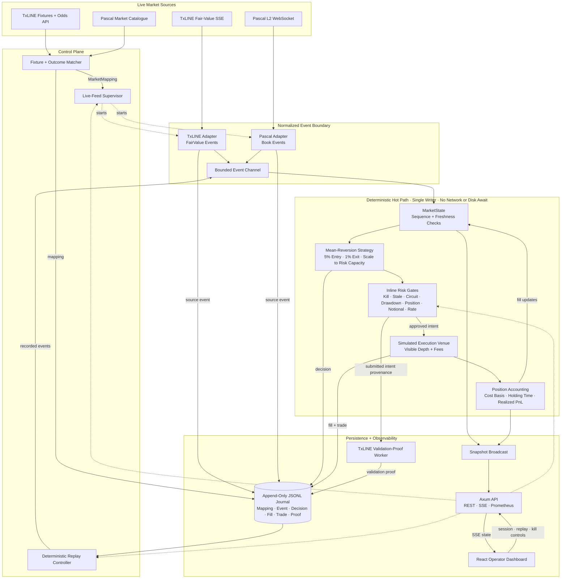

# EdgeRunner

EdgeRunner is a deterministic, low-latency trading engine for sports prediction markets. It consumes TxLINE fair probabilities and a venue L2 order book, evaluates a fixed-point dislocation strategy, applies inline risk gates, and sends approved intents to a simulated execution venue.

The service only processes real market data. With a complete TxLINE and Pascal configuration it records the live streams to a journal; without that configuration it starts in an explicit inactive state and never invents prices, books, or score updates.

## Architecture



Live and replay events share the same deterministic engine path; only the event source changes.

- `edgerunner-core`: fixed-point types, pure strategy contract, risk engine, simulated venue, journal, replay, and latency histograms.
- `edgerunner-adapters`: TxLINE SSE and stateful Pascal L2 WebSocket adapters.
- `edgerunner-service`: CLI, live-feed supervision, append-only journal worker, Axum API, SSE state, and static UI hosting.
- `web`: responsive React operator terminal.

## Run Locally

Prerequisites: Rust 1.95+, Node 24+, and npm 11+.

```bash
# terminal 1
cargo run -p edgerunner -- serve

# terminal 2
cd web
npm install
npm run dev
```

## Commands

```bash
# Live TxLINE SSE + Pascal L2, with simulated execution
cargo run -p edgerunner -- serve \
  --journal data/runs/latest.jsonl \
  --config config.example.toml

# Deterministically replay a journal
cargo run -p edgerunner -- replay \
  --journal data/runs/latest.jsonl \
  --config config.example.toml

# Benchmark a fixed recording from the normalized event-to-decision core
cargo run --release -p edgerunner -- bench \
  --journal data/runs/latest.jsonl \
  --max-events 100000 \
  --config config.example.toml

# Compare HTTP round-trip time from a deployment candidate
cargo run --release -p edgerunner -- probe \
  --url https://txline.txodds.com/api/ \
  --url https://data.pascal.trade/api/v1/time
```

### Live Feeds, Recorded Replay, Simulated Execution

Use TxLINE devnet's free tier to get a real odds feed. TxLINE requires a signed devnet
subscription from the wallet that will own the credentials. The official
[free-tier guide](https://txline-docs.txodds.com/documentation/worldcup) and
[runnable devnet script](https://txline-docs.txodds.com/documentation/examples/devnet-examples)
perform the subscription, activation, and stream check. Keep the resulting API token in your shell
or secret manager, never in the repository.

```bash
# The credentials must be activated against the same devnet wallet that submitted the subscription.
export TXLINE_ORIGIN=https://txline-dev.txodds.com
export TXLINE_API_TOKEN=...

# Start automatic TxLINE fixture/Pascal market discovery.
cargo run -p edgerunner -- serve
```

With only `TXLINE_API_TOKEN`, EdgeRunner fetches TxLINE's live/upcoming fixture snapshot and each
candidate's odds snapshot, then queries Pascal's public market catalogue. It only activates a feed
when both event participants, start time, market period, numeric line (where present), and outcome
match; otherwise it remains in `DISCOVERING` and retries. The TxLINE SSE connection is then filtered
to the recorded fixture and outcome selection. This never falls back to generated market data.

`TXLINE_FIXTURE_ID`, `TXLINE_MARKET`, and `PASCAL_SYMBOL` are optional overrides for a known
fixture, internal market label, or Pascal symbol. `PASCAL_WS_URL` remains optional and defaults to
`wss://data.pascal.trade/ws`.


## API
| Endpoint | Description |
|----------|-------------|
| `GET /api/health` | Service health |
| `GET /api/ready` | Trading readiness |
| `GET /api/snapshot` | Current engine state |
| `GET /api/events` | Server-Sent Events stream |
| `GET /api/metrics` | Prometheus metrics |
| `GET /api/session` | Session information |
| `POST /api/session` | Update session mode |
| `POST /api/replay` | Replay controls |
| `GET /api/feed-mode` | Feed status |
| `POST /api/feed-mode` | Start or stop live feeds |
| `POST /api/kill` | Activate kill switch |
| `POST /api/resume` | Resume execution |
---

## Verification

```bash
cargo fmt --all -- --check
cargo test --workspace
cargo clippy --workspace --all-targets -- -D warnings
cd web && npm run lint && npm run build
```

Latency metrics are separated by responsibility. The displayed decision histogram measures local engine computation. Network RTT and future venue acknowledgement must be reported separately; EdgeRunner does not combine them into a misleading "tick-to-trade" number.
