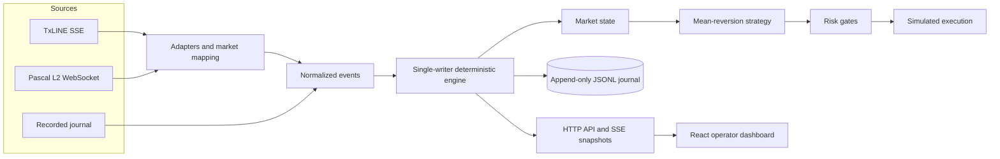

# EdgeRunner Architecture

## System Overview



Live and replay inputs differ only before event normalization. Both enter the same engine path.

## Components

| Component | Responsibility |
|---|---|
| `edgerunner-core` | Fixed-point types, market state, strategy, risk, simulation, journal schema, replay, and latency histograms |
| `edgerunner-adapters` | TxLINE SSE framing, Pascal stateful L2 book, authentication, discovery, and reconnects |
| `edgerunner-service` | CLI, feed supervision, engine ownership, journal worker, API, controls, metrics, and static UI hosting |
| `web` | Operator dashboard, replay controls, risk/latency views, trade journal, and wallet display |

## Hot Path

```text
MarketEvent
  -> MarketState::apply
  -> mark-to-market
  -> Strategy::on_event
  -> RiskEngine::evaluate
  -> ExecutionVenue::execute
  -> snapshot and journal records
```

One mutable engine processes normalized events in sequence. The decision path contains no network or disk await. Journal writes and dashboard delivery happen after the engine lock is released.

## Determinism Invariants

1. Probabilities, prices, fees, edge, and PnL use integer millionths.
2. JSON decimals are normalized once at the adapter boundary.
3. Source and venue sequence numbers only move forward; duplicate or older updates are ignored.
4. Strategy output depends only on normalized state, ordered events, and configuration.
5. Order IDs are derived from market, source sequence, venue sequence, and side.
6. Runtime timestamps and UUIDs are excluded from replay checksums.
7. Risk approval is required before simulated execution.

## Live Data Plane

The TxLINE adapter exchanges the configured API token for a guest JWT, frames SSE messages as bytes before UTF-8 decoding, and filters the selected fixture/outcome. The Pascal adapter maintains a stateful L2 book from snapshots and deltas. Feed workers reconnect with bounded exponential backoff up to 30 seconds.

When explicit IDs are absent, discovery matches event participants, start time, period, numeric line where present, and outcome before recording a market mapping. An incomplete match stays inactive; no synthetic fallback is used.

TxLINE message ID and proof timestamp provenance flow into decisions. A background worker fetches validation proofs with bounded retries and appends the raw proof record to the journal. Proof retrieval is outside the hot path.

## Control and Observation Plane

Axum exposes snapshots, an SSE event stream, Prometheus metrics, session/feed controls, replay controls, and kill/resume operations. Control routes require `x-api-token`. Loopback development defaults to `local-demo`; a non-loopback bind requires `EDGERUNNER_CONTROL_TOKEN`.

The dashboard reads canonical snapshots. Broadcast subscribers may drop intermediate UI updates under load without changing engine state.

## Backpressure and Failure Behavior

Adapters and the journal use bounded Tokio channels. Producers await capacity instead of allowing unbounded memory growth. Feed staleness, an active kill switch, a market circuit, drawdown, position/notional capacity, and order-rate violations all fail closed.

## Execution Boundary

Both live and replay modes execute against the deterministic simulated venue. It fills at the visible top of book, caps quantity to displayed depth, applies the configured taker fee, and uses a deterministic acknowledgement delay. EdgeRunner does not submit real orders to Pascal or move wallet funds.

